<picture>
  <source media="(prefers-color-scheme: dark)" srcset="./dark.svg">
  <source media="(prefers-color-scheme: light)" srcset="./light.svg">
  
</picture>

# Hi, I'm Rutvek 👋

I'm interested in **AI/ML, web development and data structures & algorithms**. I learn by building projects and improving my software-development fundamentals.

## Selected projects

- **KisanPilot** — agriculture advisory project.
- **CareNexus** — healthcare-focused project.
- **Doctor Appointment System** — appointment-booking workflow.

## Technologies

`C++` · `HTML` · `React` · `Node.js` · `GitHub` · `Machine Learning`

## Contribution Snake

> The snake will appear after you set up the included GitHub Actions workflow in a public `github-snake` repository and run it once.

<picture>
  <source media="(prefers-color-scheme: dark)" srcset="https://raw.githubusercontent.com/rutvekladhi0-dot/github-snake/output/github-snake-dark.svg">
  <source media="(prefers-color-scheme: light)" srcset="https://raw.githubusercontent.com/rutvekladhi0-dot/github-snake/output/github-snake.svg">
  
</picture>

## Connect

[GitHub](https://github.com/rutvekladhi0-dot)
